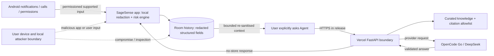

# SageSense threat model

**Scope — prototype release hardening, last updated 22 August 2026.**

This is a practical abuse review of the Android app, its local Room store, the
Vercel-hosted FastAPI Agent endpoint, and the OpenCode Go/DeepSeek provider
boundary. It is not a penetration test, a formal assurance case, or a claim of
production readiness. The current build is a physically smoke-tested debug RC,
not a production-signed or production-certified release.

## 中文摘要

主要边界是：Android 系统通知/来电 → 本地风险分析和 Room → 用户明确发起
的 Agent 查询 → Vercel FastAPI → OpenCode Go/DeepSeek。威胁包括本地设备被
入侵、恶意输入、提示注入、接口滥用、供应商留存和误判。缓解措施降低风险，
但 Room 未加密、没有用户认证、单进程限流和第三方供应商边界仍是残余风险。

## Assets and trust boundaries

| Asset | Why it matters | Primary location |
| --- | --- | --- |
| Local risk history | Can reveal a user's contacts, timing, and scam concerns even after redaction | Android Room; non-demo rows expire after 30 days |
| Redacted event fields | Sender label, URL origin/domain, signal codes, score, source and timestamps drive warnings and local memory | Android Room and explicit Agent context |
| Watchlist and provenance | Local lookup data and source links affect call warnings and explanations | Android Room / curated app data |
| Agent question/context | User intent and redacted evidence can still be sensitive | In-memory Android/backend/provider request path |
| Provider API key | Could create cost, abuse, or data exposure if disclosed | Vercel/server environment only |
| Knowledge cards/citations | Incorrect or stale sources can create unsafe advice | Backend repository and Agent output |
| Permission and overlay state | Determines which OS data the app can receive and where a warning can appear | Android system/app settings |
| Debug caller fixture | Test phone number and call-path QA data | Debug APK's local Room only |

### Boundaries and data flow

Trust boundaries are the Android OS/app boundary, the device/network boundary,
the Vercel/backend boundary, and the third-party model-provider boundary. The
backend is not a user identity boundary: no account, attestation, or trusted
client install ID is assumed.

## Abuse cases, mitigations, and residual risk

| ID / threat | Mitigations in this prototype | Residual risk / evidence needed |
| --- | --- | --- |
| T1. A scammer sends an urgent, branded, or malformed notification to evade the local detector or cause a false alarm. | Deterministic local signals, explainable evidence, conservative Personal Scam Memory, bilingual “evidence not proof” copy, no automatic action. | Heuristics cannot guarantee precision/recall; Unicode, new campaigns, and benign lookalikes need a representative corpus and regression evaluation. |
| T2. A malicious or over-privileged app abuses notification access or a granted overlay. | Access is opt-in and revocable; only supported notification input is used; the overlay is event-only and never reads/captures/OCRs the screen or uses `AccessibilityService`. | Any app with OS-granted notification access can see what Android exposes; OEM permission UX and platform policy need review. |
| T3. A local attacker reads history or debug files. | Redaction, versioned legacy-row rewrite, 30-day non-demo pruning, delete-all, Android backup disabled in current manifest, and no raw event context sent by default. | Room is not encrypted at rest; unlocked/rooted/debugged devices and forensic recovery remain out of scope. |
| T4. A user accidentally puts a password, OTP, card, or personal detail in an Agent question. | Explicit query gate, client re-sanitisation, pattern redaction, bounded payload, UI guidance not to submit secrets. | Redaction is heuristic; provider/hosting logs or transient processing may still receive what survives. User must avoid secrets. |
| T5. Prompt injection or extraction in a message/question makes the model reveal instructions, unsafe action, or unrelated data. | Topic gate runs before provider call; Pydantic bounds; read-only tools; max three rounds; strict output schema; citation IDs allowlisted; safe actions require confirmation. | Model/provider bugs and novel injections remain possible; no formal adversarial evaluation has been completed. |
| T6. An attacker steals the provider key from the APK or repository. | Key is server-side Vercel configuration; the Android client calls SageSense, not the provider; source checks reject secrets. | Vercel/maintainer compromise, accidental logs, or poor secret rotation still require operational controls and periodic scanning. |
| T7. Public callers cause cost exhaustion, scraping, or denial of service. | Input bounds, process-local 8/minute and 2-concurrent limiter, no request-body persistence, no-store headers, deterministic fallback. | Limiter resets on process restart and is not shared across instances. Add Vercel WAF, durable quotas, auth/attestation options, alerting, and cost ceilings before real deployment. |
| T8. Network interception or replay exposes or repeats a query. | Release/main requires HTTPS; provider key is not on-device; responses are marked no-store and CORS is closed to browser origins. | No user session, replay nonce, or end-to-end identity binding; debug local HTTP is intentionally allowed only for development. |
| T9. Logs, caches, validation errors, or telemetry accidentally echo personal content. | Backend validation errors use a stable message; logs record exception type/status; no analytics SDK; request bodies are not persisted; no-store response. | Hosting, edge, proxy, crash, or provider logs may have independent policies; audit production log sinks and retention. |
| T10. A poisoned Watchlist/source causes a user to distrust a legitimate caller or follow bad guidance. | Source title/URL provenance, labelled seeded fixtures, curated cards, no automatic blocking or claim of certainty. | Current fixtures are not live threat intelligence; source freshness, authenticity, regional coverage, and legal review are unfinished. |
| T11. Debug QA hook is shipped or invoked by another app. | Receiver is debug-only and protected by signature-level `DUMP`; release merged manifest excludes it; test values stay local. | Debug APK remains unsafe to distribute as production; verify release manifest and artifact before publishing. |
| T12. Delete/retention controls fail or imply erasure from third parties. | Local DAO pruning after 30 days and delete-all UI; no cloud history or backend request-body store. | OS files, backups/forensics, infrastructure metadata, and provider copies may persist; deletion needs device/provider verification in a production system. |
| T13. A user treats a low score or model answer as a safety guarantee. | Warnings say evidence, not a fraud verdict; Agent gives pause/verify guidance and confirmation-required actions; calls continue ringing. | Human over-reliance and social engineering remain; moderated older-adult research and incident feedback are needed. |

## Residual-risk priorities

Before commercial or real-user deployment, the highest-priority work is:

1. encrypt local storage and review Android backup/forensic exposure;
2. put durable WAF/rate/cost controls and abuse monitoring in front of every
   backend instance, then rotate and monitor provider secrets;
3. perform adversarial, privacy, dependency, and penetration testing;
4. obtain legal/data-protection and Android/Play policy review, including the
   model provider's terms and retention; and
5. validate detection quality and accessibility on representative physical
   devices with an incident and deletion process.

## Security and privacy non-goals

SageSense does not aim to be a complete anti-fraud database, malware scanner,
screen reader, OCR tool, call blocker, payment approver, identity service,
anonymous network, or secure vault. It does not promise availability, perfect
detection, provider-side deletion, immunity from a compromised device, or
legal compliance by virtue of this prototype documentation.

See [PRIVACY.md](../PRIVACY.md), [SECURITY.md](../SECURITY.md), the
[product-readiness audit](product-readiness-audit.md), and the
[test report](test-report.md) for scope and current evidence.
